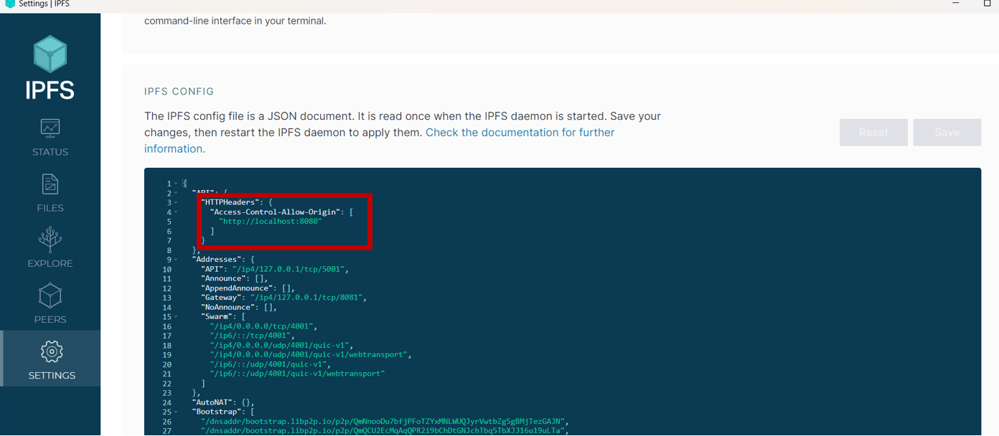
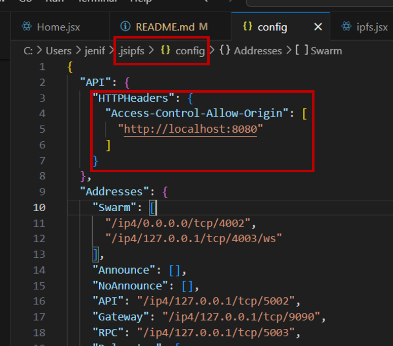

# 🏃‍♀️Run

## Using Docker

// TODO

## Not using Docker

(Make sure you have hardhat installed. If not: "npm install --save-dev hardhat")
1. cd backend < npx hardhat compile < npx hardhat node and, in a seperate powershell: npx hardhat run scripts/deploy_all.js --network localhost
2. cd client < npm run start

# Frequent Problems:

## CORS Problems
If CORS problems are encountered:
1. If you're using IPFS Desktop App:

2. If you're using a local IPFS Node:

